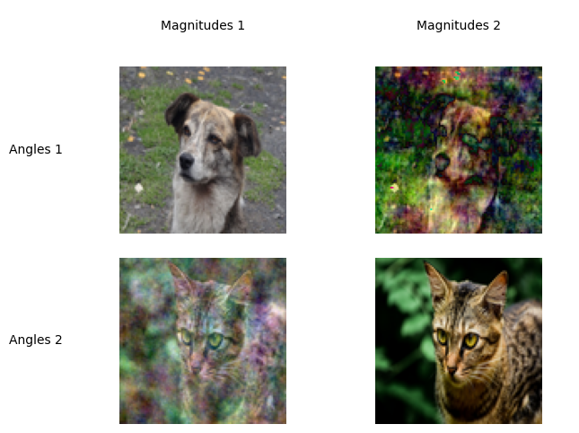
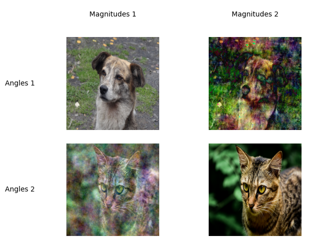

# compressed-sensing-program

A algorithm for blending images by interpolating between magnitudes and angles in the discrete Fourier transform of two images.

Main script is in `main.ipynb`.

Example result:

Sources:

[Inspired by this article](https://arxiv.org/abs/1203.4756)

[Dog example image](https://commons.wikimedia.org/wiki/File:Canis_lupus_familiaris_Perro_Mestizo.JPG)

[Parrot example image](https://commons.wikimedia.org/wiki/File:Domestic_cat_by_Shagil_Kannur002.jpg)
