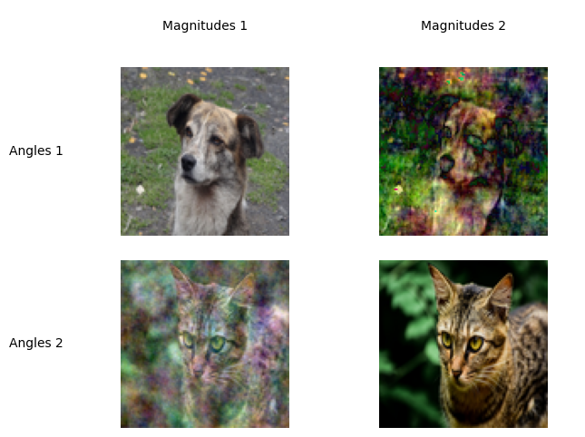
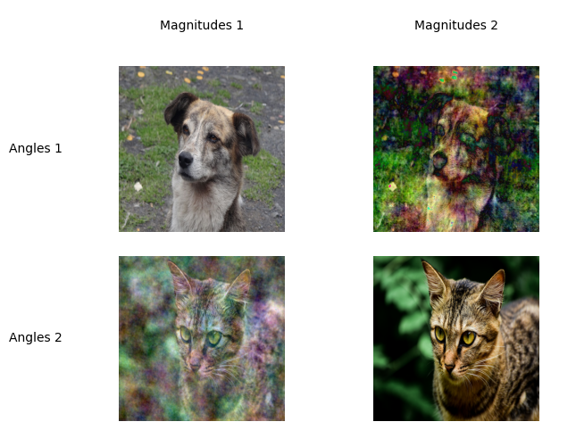

# compressed-sensing-program

Main program for mixing image magnitudes and angles after performing
a Discrete Fourier transform is `main.ipynb`.

Example result:

Sources:

[Inspired by this article](https://arxiv.org/abs/1203.4756)

[Dog example image](https://commons.wikimedia.org/wiki/File:Canis_lupus_familiaris_Perro_Mestizo.JPG)

[Parrot example image](https://commons.wikimedia.org/wiki/File:Domestic_cat_by_Shagil_Kannur002.jpg)
